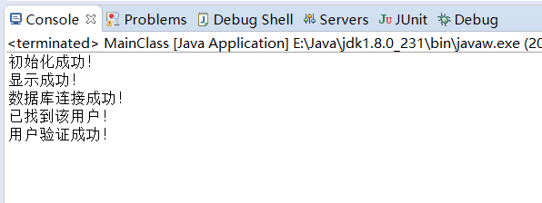

# 第一次作业

作业目的：用单一职责原则以简单的方式实现例题，并上传到个人的github。

作业完成情况：

分别写了四个类实现用户登录功能类图中所给出的方法和相关需求。以下为源代码，具体功能的实现部分用较为简单的方式进行实现，主要是展现单一职责原则的特点。

DBUtil类：

//注解部分为jdbc实现数据库连接的实际操作，本次作业未运行

```java
package dbutil;

import java.sql.Connection;


public class DBUtil {
	/**
	 * 连接数据库的操作
	 */
	public static String username = "root";
	public static String password = "1234";
	//public static String url = "jdbc:mysql://localhost:3306/books";
/*static{
	try {
		Class.forName("com.mysql.jdbc.Driver");
	} catch(ClassNotFoundException e){
		e.printStackTrace();
	}
}*/

//连接数据库
public static Connection getConnection(){
	/*Connection conn = null;
	try{
		conn = DriverManager.getConnection(url,username,password);
		System.out.println("数据库连接成功！");
	
	} catch (SQLException e){
		e.printStackTrace();
		System.out.println("数据库连接失败！");
	}*/
	Connection conn=null;
	if(username=="root"&&password=="1234") {
		System.out.println("数据库连接成功！");
	}else {
		System.out.println("数据库连接失败！");
	}
	return conn;
}
```
}

UserDao类：	

```java
package dao;

import java.sql.Connection;

import dbutil.DBUtil;

public class UserDao {
	private DBUtil db;
	//根据提供的用户名和密码判断用户是否存在
	public boolean findUser(String userName,String passWord) {
		Connection conn=db.getConnection();
		if(userName=="abc"&&passWord=="123") {
		System.out.println("已找到该用户！");
		return true;
		}else {
			System.out.println("未找到该用户！");
			return false;
		}
    }
```

LoginForm类：	

```java
package login;

import dao.UserDao;

public class LoginForm {
	private UserDao dao=new UserDao();
	private String userName;
	private String passWord;
	public LoginForm(String userName,String passWord) {
		this.userName=userName;
		this.passWord=passWord;
		init();
		display();
		validate(userName,passWord);
	}
	//初始化
	public void init() {
		System.out.println("初始化成功！");
	}
//展示页面
public void display() {
	System.out.println("显示成功！");
}

//验证用户
public void validate(String userName,String passWord) {
	if(dao.findUser(userName, passWord)==true) {
	System.out.println("用户验证成功！");
}else {
	System.out.println("用户验证失败！");
}
}

public String getUserName() {
	return userName;
}

public void setUserName(String userName) {
	this.userName = userName;
}

public String getPassWord() {
	return passWord;
}

public void setPassWord(String passWord) {
	this.passWord = passWord;
}
}
```
MainClass类：

```java
package main;

import login.LoginForm;

public class MainClass {
public static void main(String[] args) {
	// TODO Auto-generated method stub
	LoginForm loginform=new LoginForm("abc","123");
	
}
}
```


实现情况截图：

